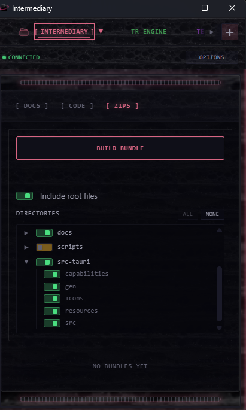

# Intermediary

Intermediary is a desktop handoff console for getting trustworthy local repo context into ChatGPT and other browser-based LLMs. It keeps the latest docs, code, and screenshots ready to drag out, and it builds timestamped context bundles so the model can work from the repo state you meant to share instead of stale uploads or pasted snippets.



## Why It Exists

Intermediary is built around two recurring problems in ChatGPT-first coding workflows:

- Broad context sharing is unreliable when it depends on ad-hoc file uploads or pasted code. Browser-based LLMs often work better when you give them a single self-contained repo bundle with clear provenance.
- Incremental sharing is tedious when the latest files live in nested folders, worktrees, WSL repos, or screenshots you just captured. The "last mile" becomes manual hunting instead of actual problem solving.

## What It Solves

Intermediary keeps that handoff loop in one place:

- Builds timestamped zip bundles with a `BUNDLE_MANIFEST.json` provenance record.
- Surfaces recently changed docs and code so the newest files are always near the top.
- Lets you favourite the files you hand off repeatedly.
- Stages drag-and-drop-safe host-side copies for files that started in WSL or deep repo paths.
- Makes screenshot sharing easier in browser chats and coding-agent chats that accept image drops.

## Screenshot

The screenshot above is tracked at [assets/readme/intermediary_window.png](assets/readme/intermediary_window.png).

## Recommended Workflow

1. Add the repo to Intermediary and let it surface recent code/docs.
2. Build a bundle when the model needs broad repo context.
3. Upload the latest bundle into a ChatGPT Project or other browser-based LLM workspace.
4. As the conversation narrows, drag staged files or screenshots directly from Intermediary instead of reopening Explorer, `\\wsl$`, or a deep worktree path.

Many users also paste the latest bundle filename into the prompt as an explicit "use this one" hint. That is an operator habit, not a product requirement, but it pairs well with the latest-bundle workflow.

## Recommended ChatGPT Setup

Intermediary does not integrate with ChatGPT directly and should not be described as an official integration. The intended workflow is still browser-first: build a bundle or drag staged files, then upload them into the tool you already use.

For the best bundle-first workflow, use a ChatGPT Project and pair it with the companion instructions in [docs/environment/chatgpt_custom_instructions.md](docs/environment/chatgpt_custom_instructions.md). The short version of that setup is:

```text
{repoId}_{presetId}_{YYYYMMDD_HHMMSS}_{shortSha}.zip
```

- Intermediary keeps one bundle per repo+preset. Building a new one replaces the previous bundle for that repo/preset.
- Every bundle includes `BUNDLE_MANIFEST.json` with timestamp, repo, preset, and git metadata.
- When multiple bundles exist, choose the newest filename timestamp first. If needed, confirm with `generatedAt` inside the manifest.
- Open `BUNDLE_MANIFEST.json` first, then use `docs/guide.md` in the bundle to navigate the project docs.
- Treat the provided bundle as the source of truth for that repo.

This setup is the recommended default for getting the full value from Intermediary. It is still a companion workflow, not a hidden runtime requirement.

## Support Matrix

| Environment | Status | Notes |
| --- | --- | --- |
| Windows 10/11 + WSL2 | Maintainer-validated | Recommended path for the full workflow, including the bundled Linux WSL backend. |
| Windows 10/11 without WSL2 | Maintainer-validated | Validated for host-native repo workflows; the WSL companion/backend path does not apply. |
| macOS | Experimental | Code paths exist in places, but the maintainer has not validated macOS to the same standard as Windows. |
| Linux | Experimental | Code paths exist in places, but the maintainer has not validated Linux to the same standard as Windows. |

If you are evaluating the repo as a portfolio project, read "supported today" as "Windows 10/11," with WSL2 as the recommended path for the full handoff workflow.

## Install And Build

Intermediary is currently documented as a source-first project.

- Windows + WSL setup and daily development flow: [docs/commands/dev_windows.md](docs/commands/dev_windows.md)
- WSL backend agent workflow: [docs/commands/dev_wsl_agent.md](docs/commands/dev_wsl_agent.md)
- Closeout and verification commands: [docs/commands/workflow/closeout_checks.md](docs/commands/workflow/closeout_checks.md)

Prerequisites for the recommended Windows + WSL2 path:

- Windows 10 or 11
- WSL2
- Rust stable
- Node.js 20+
- pnpm

## Privacy

- Intermediary is designed for local-first use.
- The repo docs specify no telemetry by default.
- Bundle manifests include provenance such as repo ID, preset, timestamps, and best-effort git metadata so uploads are auditable.
- Repo access is scoped to the roots you configure inside the app; it is not a cloud sync tool.

## Known Limits

- Windows 10/11 is the maintainer-tested runtime today; WSL2 is recommended when you want the full WSL-backed workflow.
- Bundle sharing is drag-and-drop based; there is no direct ChatGPT API or official ChatGPT integration in the product.
- LLM tool behavior still varies. The Project + bundle + companion-instructions workflow improves reliability, but it does not force the tool to behave perfectly.
- Very large or contended WSL bundle builds can still time out; see [docs/known_issues.md](docs/known_issues.md).
- Mounted Windows paths inside WSL can have degraded watcher reliability on large trees; the validated path is native WSL repos with Windows-hosted UI/runtime.

## Documentation

Start with [docs/guide.md](docs/guide.md) for the docs index, then read:

- [docs/system_overview.md](docs/system_overview.md) for architecture
- [docs/prd.md](docs/prd.md) for product intent and implementation scope
- [docs/known_issues.md](docs/known_issues.md) for current limitations

## License

This repository is licensed under the [MIT License](LICENSE).
